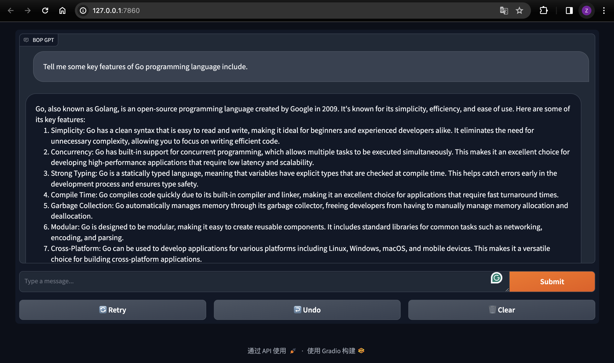

### The BOP LLaMA is using locally running LLaMA2 7B Chat model,it using llama-cpp-python library and Graio for UI

```
conda create -n llm python=3.11

conda activate llm
python BOP_LLM_GradioUI.py
```



#### if Mac GPU (M1...) not using, try the following

```bash
pip uninstall llama-cpp-python
CMAKE_ARGS="-DLLAMA_METAL=on" pip install llama-cpp-python==0.2.27
```
